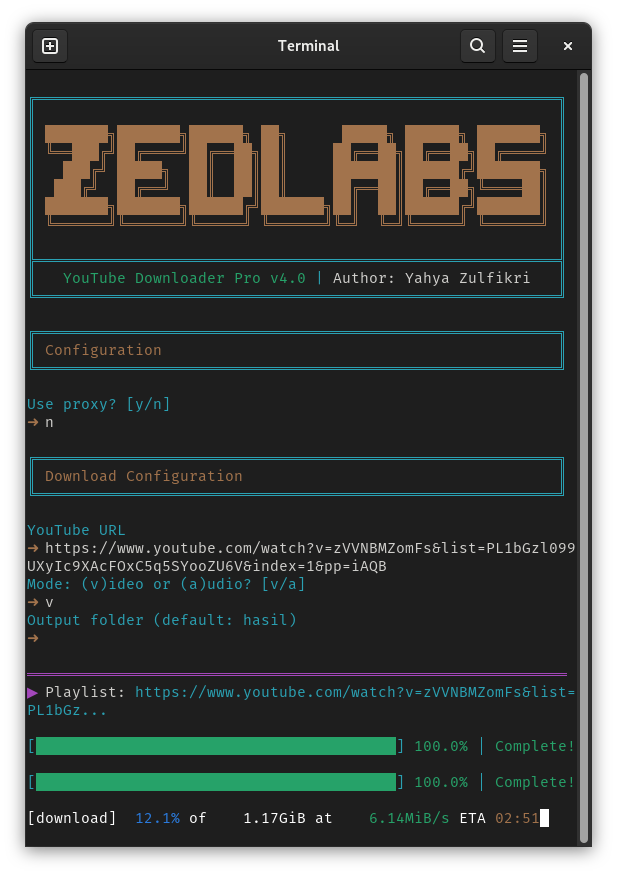

# ZEDLABS YouTube Downloader

Alat CLI Python berkinerja tinggi untuk mengunduh video dan audio dari YouTube, media sosial, dan lebih dari 1000 situs. Dilengkapi dengan dukungan proxy canggih dan antarmuka terminal animasi.

<div align="center">

</div>

## Screenshots

### Single Video Mode

[Single Video/Audio Download](./screenshoot/single_mode.png)

### Playlist Mode

[Playlist Video/Audio Download](./screenshoot/playlist_mode.png)

### Proxy Mode

[Proxy System](./screenshoot/proxy_mode.png)

## Fitur Utama

### Fungsionalitas Inti

- Unduh video YouTube dalam format MP4 (kualitas terbaik)
- Ekstraksi audio dalam format MP3 (320kbps)
- Dukungan playlist lengkap dengan unduhan batch
- Progress bar real-time dengan statistik unduhan
- Folder output yang dapat disesuaikan dengan organisasi otomatis

### Fitur Lanjutan

- **Sistem Proxy Berkinerja Tinggi**: Uji dan gunakan beberapa proxy dengan fallback otomatis
- **Pengujian Proxy Konkuren**: Uji hingga 10 proxy secara bersamaan
- **Pemilihan Proxy Cerdas**: Otomatis mengurutkan dan menggunakan proxy tercepat
- **Pemantauan Latensi**: Metrik kinerja proxy real-time
- **Mekanisme Auto-Retry**: Beralih ke proxy cadangan secara otomatis saat gagal
- **Antarmuka Terminal Animasi**: Animasi loading dan indikator progress profesional

### Optimasi Kinerja

- Unduhan fragmen konkuren (5 fragmen bersamaan)
- Parsing CSV berbasis Pandas untuk pemuatan proxy lebih cepat
- ThreadPoolExecutor untuk multi-threading efisien
- Ukuran chunk optimal (10MB) untuk unduhan lebih cepat
- Manajemen timeout dan logika retry yang cerdas

---

## Instalasi

### Prasyarat

- Python 3.7 atau lebih tinggi
- FFmpeg terinstal di sistem

### Langkah Instalasi

**1. Clone repositori**

```bash
git clone https://github.com/zulfikriyahya/youtube-downloader.git
cd youtube-downloader
```

**2. Buat dan aktifkan virtual environment**

```bash
python3 -m venv venv

# Windows
venv\Scripts\activate

# macOS/Linux
source venv/bin/activate
```

**3. Install dependensi**

```bash
pip install -r requirements.txt
```

**4. Install FFmpeg**

- **Windows**: Unduh dari https://ffmpeg.org/download.html dan tambahkan ke PATH
- **macOS**: `brew install ffmpeg`
- **Linux**: `sudo apt update && sudo apt install ffmpeg`

---

## Cara Penggunaan

Jalankan skrip:

```bash
python3 main.py
```

Ikuti petunjuk interaktif:

1. Pilih apakah menggunakan proxy (y/n)
2. Jika menggunakan proxy, berikan path file CSV proxy
3. Masukkan URL video atau playlist YouTube
4. Pilih mode unduhan: (v) untuk video atau (a) untuk audio saja
5. Tentukan folder output (default: hasil)

### Pengaturan Proxy

Buat file `proxy.csv` dengan format:

```csv
ip_address
192.168.1.1:8080
10.0.0.1:3128
proxy.example.com:8888
```

Sistem akan:

- Menguji semua proxy secara bersamaan (10 thread)
- Menampilkan latensi setiap proxy
- Mengurutkan berdasarkan waktu respons
- Menggunakan proxy tercepat untuk unduhan
- Beralih otomatis ke proxy cadangan saat gagal

---

## Struktur Output

### Video Tunggal

- Video: `hasil/Judul_Video.mp4`
- Audio: `hasil/Judul_Video.mp3`

### Playlist

- Video: `hasil/Nama_Playlist/Judul_Video.mp4`
- Audio: `hasil/Nama_Playlist/Judul_Video.mp3`

---

## Konfigurasi

Modifikasi konstanta berikut di `main.py`:

```python
CHECK_URL = "https://www.google.com"   # URL untuk pengujian proxy
TIMEOUT = 8                            # Timeout proxy dalam detik
MAX_THREADS = 10                       # Thread pengujian proxy konkuren
```

---

## Dependensi

```
yt-dlp>=2024.0.0
colorama>=0.4.6
pandas>=2.0.0
requests>=2.31.0
```

---

## Pemecahan Masalah

### Masalah Umum

**Error: FFmpeg tidak ditemukan**

- Pastikan FFmpeg terinstal dan ditambahkan ke PATH sistem
- Restart terminal setelah instalasi

**Error koneksi proxy**

- Verifikasi format proxy di CSV (ip:port)
- Uji proxy secara manual dengan curl atau browser
- Beberapa proxy mungkin memerlukan autentikasi

**Masalah kecepatan unduhan**

- Gunakan proxy dengan latensi rendah
- Kurangi unduhan fragmen konkuren
- Periksa koneksi internet

**Error sertifikat SSL**

- Perbarui yt-dlp: `pip install -U yt-dlp`
- Perbarui certifi: `pip install -U certifi`

---

## Tips Kinerja

1. **Gunakan Proxy Berkualitas**: Proxy gratis sering lambat atau tidak andal
2. **Tingkatkan Jumlah Thread**: Modifikasi MAX_THREADS untuk pengujian proxy lebih cepat
3. **Perbarui yt-dlp**: Jaga yt-dlp tetap terbaru untuk kinerja optimal
4. **Penyimpanan SSD**: Unduh ke SSD untuk kecepatan tulis lebih cepat
5. **Koneksi Stabil**: Gunakan koneksi kabel untuk unduhan besar

---

## Pemberitahuan Hukum

Alat ini hanya untuk penggunaan pribadi. Pengguna bertanggung jawab mematuhi Ketentuan Layanan YouTube dan hukum hak cipta. Jangan gunakan alat ini untuk mengunduh konten berhak cipta tanpa izin.

---

## Penulis

**Yahya Zulfikri**

GitHub: [@zulfikriyahya](https://github.com/zulfikriyahya)

---

## Lisensi

Proyek ini bersifat open source dan tersedia untuk penggunaan pribadi. Harap hormati Ketentuan Layanan YouTube dan peraturan hak cipta saat menggunakan alat ini.

---

## Riwayat Versi

### v4.0 (Terkini)

- Sistem proxy berkinerja tinggi
- Pengujian proxy konkuren dengan ThreadPoolExecutor
- Antarmuka terminal animasi
- Pemilihan proxy cerdas dan auto-fallback
- Optimasi kinerja untuk unduhan lebih cepat

### v3.0

- Dukungan playlist
- Penanganan error lebih baik
- Pelacakan progress ditingkatkan

### v2.0

- Mode audio saja
- Folder output yang dapat disesuaikan
- Implementasi progress bar

### v1.0

- Rilis awal
- Fungsionalitas dasar unduhan video

---

## Kontribusi

Kontribusi untuk meningkatkan ZEDLABS YouTube Downloader sangat diterima:

### Melaporkan Masalah

1. Periksa masalah yang ada di GitHub
2. Berikan informasi detail tentang sistem (OS, versi Python)
3. Sertakan pesan error dan log
4. Jelaskan langkah untuk mereproduksi masalah

### Pull Request

1. Fork repositori
2. Buat branch fitur: `git checkout -b nama-fitur`
3. Lakukan perubahan dan uji secara menyeluruh
4. Commit dengan pesan jelas: `git commit -m "Tambah deskripsi fitur"`
5. Push ke fork: `git push origin nama-fitur`
6. Kirim pull request dengan deskripsi detail

### Standar Kode

- Ikuti pedoman gaya PEP 8
- Tambahkan komentar untuk logika kompleks
- Perbarui dokumentasi untuk fitur baru
- Uji perubahan di berbagai platform jika memungkinkan

---

## Roadmap

### Fitur yang Direncanakan

**v5.0 (Masa Depan)**

- Antarmuka GUI dengan Tkinter
- Lanjutkan unduhan yang terputus
- Unduhan terjadwal
- Manajemen antrian unduhan
- Integrasi ekstensi browser

**v4.5 (Rilis Berikutnya)**

- Dukungan proxy SOCKS
- Pemilihan kualitas kustom
- Dukungan unduhan subtitle
- Pelacakan riwayat unduhan
- Dukungan file konfigurasi

---

## Pertanyaan Umum

**T: Bisakah mengunduh seluruh channel?**  
J: Saat ini hanya dukungan playlist yang tersedia. Unduhan channel penuh akan ditambahkan di versi mendatang.

**T: Apakah berfungsi dengan video yang dibatasi usia?**  
J: Beberapa konten yang dibatasi usia mungkin memerlukan autentikasi. Fitur ini direncanakan untuk rilis mendatang.

**T: Bisakah digunakan di server tanpa display?**  
J: Ya, alat ini berfungsi di lingkungan headless. Progress bar akan ditampilkan dengan baik di terminal mana pun.

**T: Berapa banyak proxy yang dapat diuji bersamaan?**  
J: Default adalah 10 thread konkuren. Anda dapat memodifikasi MAX_THREADS di konfigurasi.

**T: Apakah proxy premium/berbayar didukung?**  
J: Ya, gunakan format `username:password@ip:port` di file proxy.csv.

---

## Dukungan

Untuk dukungan dan pertanyaan:

- **GitHub Issues**: Laporkan bug atau minta fitur
- **Discussions**: Bergabung dengan GitHub Discussions untuk bantuan komunitas
- **Email**: Hubungi melalui profil GitHub

---

## Keamanan

### Melaporkan Kerentanan

Jika menemukan kerentanan keamanan, kirim email detail ke pengelola proyek. Jangan buat issue publik untuk masalah keamanan.

### Praktik Terbaik

- Perbarui yt-dlp dan dependensi secara berkala
- Gunakan sumber proxy terpercaya saja
- Hindari menyimpan kredensial autentikasi dalam teks biasa
- Tinjau izin file proxy.csv
