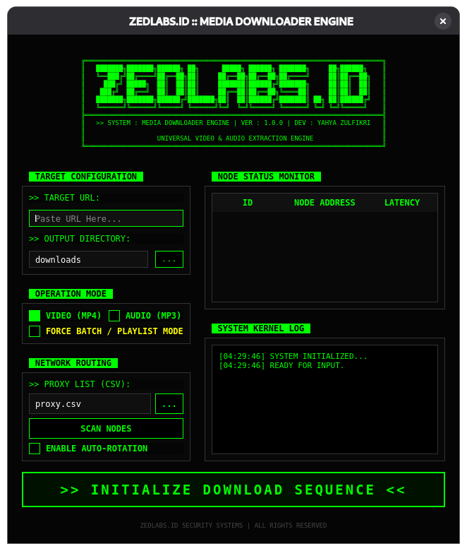
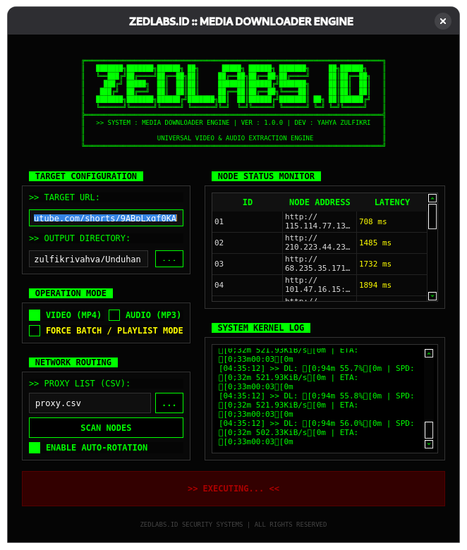

# ZEDLABS.ID Media Engine

**Universal Video & Audio Extraction Engine** berkinerja tinggi berbasis GUI Desktop. Dirancang dengan estetika _Cyberpunk Dashboard_, alat ini menggabungkan kekuatan `yt-dlp` dengan antarmuka monitoring jaringan yang canggih untuk mengunduh media dari ribuan situs secara anonim dan cepat.

<div align="center">

</div>

## Screenshots

### Main Dashboard (Command Center)

<div align="center">

</div>

_Antarmuka terpusat dengan kontrol input di kiri dan monitoring sistem di kanan._

### Network Node Scanner

<div align="center">

</div>

_Pemindaian proxy multi-threaded dengan visualisasi latensi real-time._

### Process Monitor

<div align="center">

</div>

_Kernel Log live dan status unduhan batch._

---

## Fitur Utama

### Antarmuka & Pengalaman (GUI)

- **Cyberpunk Dashboard Design**: Tata letak modern dengan skema warna _High-Contrast_ (Black/Neon Green).
- **Split-View Layout**: Kolom kiri untuk konfigurasi target, kolom kanan untuk monitoring sistem.
- **Responsive Fullscreen**: Jendela aplikasi otomatis menyesuaikan dengan ukuran layar (fullscreen/maximized by default).
- **Kernel Log System**: Jendela log real-time yang menampilkan aktivitas internal mesin.

### Mesin Unduhan (Core Engine)

- **Universal Support**: Mendukung YouTube, TikTok, Instagram, Twitter/X, dan 1000+ situs lainnya.
- **Dual-Mode Extraction**:
  - **VIDEO (MP4)**: Kualitas visual terbaik dengan penggabungan audio/video otomatis.
  - **AUDIO (MP3)**: Ekstraksi audio murni dengan post-processing FFmpeg.
- **Quality Preset System**: Tiga preset kualitas untuk mengontrol ukuran file dan kecepatan download:
  - **MAXIMUM**: Kualitas terbaik tersedia (hingga 4K/8K video, audio bitrate tertinggi)
  - **BALANCED**: 1080p video / 320kbps audio (Recommended - sweet spot antara kualitas dan ukuran)
  - **ECONOMY**: 720p video / 192kbps audio (Hemat ruang penyimpanan)
- **Smart Playlist Detection**: Deteksi otomatis URL playlist/batch dan opsi untuk memaksakan mode playlist.

### Jaringan & Anonimitas

- **Advanced Proxy Scanner**: Menguji ratusan proxy dalam hitungan detik menggunakan _Concurrent Threading_.
- **Latency Visualization**: Menampilkan status "Node" (Proxy) dengan indikator warna berdasarkan kecepatan (Hijau/Kuning/Merah).
- **Auto-Rotation System**: Secara otomatis merutekan unduhan melalui proxy tercepat dan melakukan _failover_ jika koneksi terputus.

---

## Instalasi

### Prasyarat Sistem

- **Python 3.8** atau lebih tinggi.
- **FFmpeg** terinstal dan terdaftar di PATH sistem (Wajib untuk konversi MP3/MP4).

### Langkah Instalasi

**1. Clone repositori**

```bash
git clone https://github.com/zulfikriyahya/zedlabs-media-engine.git
cd zedlabs-media-engine
```

**2. Buat dan aktifkan virtual environment (Disarankan)**

```bash
python -m venv venv

# Windows
venv\Scripts\activate

# macOS/Linux
source venv/bin/activate
```

**3. Install dependensi**

```bash
pip install -r requirements.txt
```

**4. Verifikasi FFmpeg**

Pastikan FFmpeg sudah terinstal. Cek dengan perintah:

```bash
ffmpeg -version
```

Jika belum terinstal, download dari [ffmpeg.org](https://ffmpeg.org/download.html) dan tambahkan ke PATH sistem Anda.

---

## Cara Penggunaan

Jalankan aplikasi dengan perintah:

```bash
python main.py
```

### Panduan Dashboard

1.  **Target Configuration (Kiri Atas)**
    - Tempelkan URL video/playlist pada kolom **URL**.
    - Pilih folder output (Default: `downloads`).

2.  **Operation Mode (Kiri Tengah)**
    - Pilih Format: **MP4** (Video) atau **MP3** (Audio).
    - Centang **"FORCE PLAYLIST"** jika ingin mengunduh satu album/playlist penuh.

3.  **Quality Preset (Kiri Tengah Bawah)**
    - **MAXIMUM**: Kualitas terbaik (file besar, download lambat)
    - **BALANCED**: 1080p/320kbps (recommended untuk kebanyakan kasus)
    - **ECONOMY**: 720p/192kbps (hemat space, download cepat)

4.  **Proxy / Network (Kiri Bawah) - Opsional**
    - Masukkan file CSV proxy (Format: `ip:port`).
    - Klik **SCAN NODES** untuk memvalidasi node yang aktif.
    - Centang **AUTO ROTATE** untuk mengaktifkan sistem anonimitas.

5.  **Eksekusi**
    - Klik tombol besar **>> INITIALIZE DOWNLOAD SEQUENCE <<**.
    - Pantau progres di **Live Monitor** dan **Kernel Log** di sebelah kanan.
    - Gunakan tombol **ABORT** untuk membatalkan download yang sedang berjalan.

---

## Build / Compile (Executable)

Anda dapat mengubah source code Python ini menjadi aplikasi _standalone_ (`.exe` di Windows atau binary di Linux) agar bisa dijalankan tanpa perlu menginstall Python.

### Persiapan Build

Pastikan struktur folder Anda seperti ini:

```
zedlabs-media-engine/
├── main.py
├── requirements.txt
├── compiler-linux-amd64.sh      (untuk Linux)
├── compiler-windows-amd64.bat   (untuk Windows)
├── images/
│   └── icon.ico
└── lib/
    ├── ffmpeg           (untuk Linux)
    └── ffmpeg.exe       (untuk Windows)
```

**Download FFmpeg:**

- **Linux**: `sudo apt-get install ffmpeg` lalu copy binary ke `lib/ffmpeg`
- **Windows**: Download dari [ffmpeg.org](https://ffmpeg.org/download.html), extract, dan copy `ffmpeg.exe` ke `lib/`

### Build di Linux (Ubuntu/Debian)

Gunakan script compiler yang sudah disediakan:

```bash
# Berikan permission execute
chmod +x compiler-linux-amd64.sh

# Jalankan compiler
./compiler-linux-amd64.sh
```

Script ini akan otomatis:

1. Install `python3-venv` jika belum ada
2. Membuat virtual environment
3. Install semua dependencies
4. Build executable dengan PyInstaller
5. Bundle ffmpeg ke dalam aplikasi

**Output:** File executable akan ada di folder `dist/MultimediaDownloader`

**Cara menjalankan:**

```bash
cd dist
./MultimediaDownloader
```

### Build di Windows 11

Gunakan script compiler yang sudah disediakan:

**Cara 1: Double-click file batch**

- Double-click file `compiler-windows-amd64.bat`
- Tunggu proses selesai

**Cara 2: Via Command Prompt**

```cmd
compiler-windows-amd64.bat
```

**Cara 3: Via PowerShell**

```powershell
.\compiler-windows-amd64.ps1
```

Script ini akan otomatis:

1. Check instalasi Python
2. Membuat virtual environment
3. Install semua dependencies
4. Build executable dengan PyInstaller
5. Bundle ffmpeg.exe ke dalam aplikasi

**Output:** File executable akan ada di folder `dist\MultimediaDownloader.exe`

**Catatan untuk Windows:**

- Jika muncul error "cannot be loaded because running scripts is disabled", jalankan PowerShell sebagai Administrator dan eksekusi:
  ```powershell
  Set-ExecutionPolicy -ExecutionPolicy RemoteSigned -Scope CurrentUser
  ```
- Antivirus mungkin memblokir file .exe yang baru di-build. Tambahkan folder `dist\` ke whitelist antivirus Anda.

### Build Manual (Jika Script Gagal)

**Linux:**

```bash
source venv/bin/activate
pip install -r requirements.txt
pyinstaller --onefile --windowed \
  --add-binary "lib/ffmpeg:." \
  --name "MultimediaDownloader" \
  --icon=images/icon.ico \
  main.py
```

**Windows:**

```cmd
venv\Scripts\activate
pip install -r requirements.txt
pyinstaller --onefile --windowed ^
  --add-binary "lib\ffmpeg.exe;." ^
  --name "MultimediaDownloader" ^
  --icon=images\icon.ico ^
  main.py
```

---

## Struktur File Proxy

Untuk menggunakan fitur proxy, buat file `proxy.csv` dengan format sederhana:

```csv
ip_address
192.168.1.1:8080
103.10.10.1:3128
user:pass@192.168.1.2:8000
```

atau format tanpa header:

```csv
192.168.1.1:8080
103.10.10.1:3128
user:pass@192.168.1.2:8000
```

Aplikasi mendukung format:

- HTTP/HTTPS Proxy: `ip:port` atau `http://ip:port`
- SOCKS5 Proxy: `socks5://ip:port`
- Authenticated Proxy: `user:pass@ip:port`

---

## Dependensi Project

Project ini dibangun menggunakan library open-source yang kuat:

- **PyQt6**: Framework GUI modern untuk antarmuka desktop.
- **yt-dlp**: Core engine untuk ekstraksi media (fork dari youtube-dl yang lebih aktif).
- **pandas**: Pemrosesan data proxy berkecepatan tinggi.
- **requests**: Pengujian konektivitas jaringan.
- **pyinstaller**: Packaging aplikasi Python menjadi executable.

---

## Pemecahan Masalah (Troubleshooting)

### Masalah: Aplikasi tidak terbuka / Error PyQt6

**Solusi:**

- Pastikan Anda menggunakan Python versi 3.8 ke atas.
- Coba install ulang dependensi: `pip install --upgrade PyQt6`.
- Di Linux, install dependencies sistem: `sudo apt-get install libxcb-cursor0`

### Masalah: "FFmpeg not found" di Log

**Penyebab:** Aplikasi tidak dapat menggabungkan video/audio atau mengkonversi ke MP3.

**Solusi:**

- **Untuk development**: Install FFmpeg di sistem dan tambahkan ke PATH
- **Untuk build executable**: Pastikan file `ffmpeg` atau `ffmpeg.exe` ada di folder `lib/` sebelum build

### Masalah: Download macet / Lambat

**Solusi:**

- Jika menggunakan Proxy, coba matikan fitur **Auto Rotate** atau scan ulang untuk mencari proxy yang lebih cepat (Latency rendah/Hijau).
- Gunakan Quality Preset **ECONOMY** untuk download lebih cepat.
- Periksa koneksi internet Anda.

### Masalah: Build executable gagal di Windows

**Error: "pyinstaller: command not found"**

```cmd
pip install pyinstaller
```

**Error: "No module named 'PyQt6'"**

```cmd
pip install -r requirements.txt
```

### Masalah: Executable tidak jalan di komputer lain

**Penyebab:** Missing system libraries atau ffmpeg tidak ter-bundle.

**Solusi:**

- Pastikan menggunakan flag `--add-binary` saat build untuk include ffmpeg
- Gunakan script compiler yang sudah disediakan (sudah include flag yang benar)
- Di Windows, distribusikan bersama dengan Visual C++ Redistributable

---

## Pemberitahuan Hukum

**ZEDLABS.ID Media Engine** adalah alat untuk tujuan edukasi dan penggunaan pribadi (misalnya: pengarsipan konten milik sendiri atau _Fair Use_).

**Pengguna bertanggung jawab penuh untuk:**

- Mematuhi Ketentuan Layanan (ToS) dari situs web target
- Menghormati hak cipta dan intellectual property
- Tidak menggunakan alat ini untuk pembajakan atau distribusi ilegal

Developer tidak bertanggung jawab atas penyalahgunaan aplikasi ini.

---

## Kontribusi

Kontribusi sangat diterima! Jika Anda ingin berkontribusi:

1. Fork repositori ini
2. Buat branch fitur baru (`git checkout -b feature/AmazingFeature`)
3. Commit perubahan Anda (`git commit -m 'Add some AmazingFeature'`)
4. Push ke branch (`git push origin feature/AmazingFeature`)
5. Buat Pull Request

---

## Lisensi

Project ini menggunakan lisensi MIT. Lihat file `LICENSE` untuk detail lengkap.

---

## Penulis

**Yahya Zulfikri**

_Lead Developer @ ZEDLABS.ID_

- GitHub: [@zulfikriyahya](https://github.com/zulfikriyahya)
- Email: yahya@zedlabs.id

---

## Changelog

### Version 2.0.0 (Latest)

- Tambah fitur Quality Preset (MAXIMUM/BALANCED/ECONOMY)
- Responsive fullscreen layout
- Tombol cancel download
- Improved UI spacing dan consistency
- Better error handling

### Version 1.0.0

- Initial release
- Basic video/audio download
- Proxy scanner
- GUI cyberpunk theme
