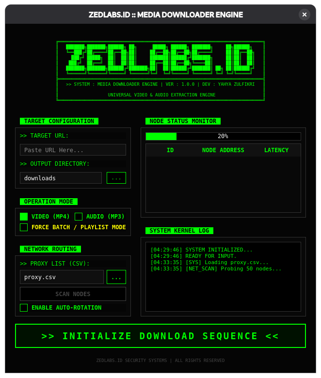

# ZEDLABS.ID Media Engine

**Universal Video & Audio Extraction Engine** berkinerja tinggi berbasis GUI Desktop. Dirancang dengan estetika _Cyberpunk Dashboard_, alat ini menggabungkan kekuatan `yt-dlp` dengan antarmuka monitoring jaringan yang canggih untuk mengunduh media dari ribuan situs secara anonim dan cepat.

<div align="center">

</div>

## Screenshots

### Main Dashboard (Command Center)

<div align="center">

</div>

_Antarmuka terpusat dengan kontrol input di kiri dan monitoring sistem di kanan._

### Network Node Scanner

<div align="center">

</div>

_Pemindaian proxy multi-threaded dengan visualisasi latensi real-time._

### Process Monitor

<div align="center">

</div>

_Kernel Log live dan status unduhan batch._

---

## Fitur Utama

### Antarmuka & Pengalaman (GUI)

- **Cyberpunk Dashboard Design**: Tata letak modern dengan skema warna _High-Contrast_ (Black/Neon Green).
- **Split-View Layout**: Kolom kiri untuk konfigurasi target, kolom kanan untuk monitoring sistem.
- **Fixed Compact Size**: Jendela aplikasi terkunci pada ukuran optimal (900x650) untuk kerapian visual.
- **Kernel Log System**: Jendela log real-time yang menampilkan aktivitas internal mesin.

### Mesin Unduhan (Core Engine)

- **Universal Support**: Mendukung YouTube, TikTok, Instagram, Twitter/X, dan 1000+ situs lainnya.
- **Dual-Mode Extraction**:
  - **VIDEO (MP4)**: Kualitas visual terbaik dengan penggabungan audio/video otomatis.
  - **AUDIO (MP3)**: Ekstraksi audio murni (320kbps) dengan post-processing FFmpeg.
- **Smart Playlist Detection**: Deteksi otomatis URL playlist/batch dan opsi untuk memaksakan mode playlist.

### Jaringan & Anonimitas

- **Advanced Proxy Scanner**: Menguji ratusan proxy dalam hitungan detik menggunakan _Concurrent Threading_.
- **Latency Visualization**: Menampilkan status "Node" (Proxy) dengan indikator warna berdasarkan kecepatan (Hijau/Kuning/Merah).
- **Auto-Rotation System**: Secara otomatis merutekan unduhan melalui proxy tercepat dan melakukan _failover_ jika koneksi terputus.

---

## Instalasi

### Prasyarat Sistem

- **Python 3.8** atau lebih tinggi.
- **FFmpeg** terinstal dan terdaftar di PATH sistem (Wajib untuk konversi MP3/MP4).

### Langkah Instalasi

**1. Clone repositori**

```bash
git clone https://github.com/zulfikriyahya/zedlabs-media-engine.git
cd zedlabs-media-engine
```

**2. Buat dan aktifkan virtual environment (Disarankan)**

```bash
python -m venv venv

# Windows
venv\Scripts\activate

# macOS/Linux
source venv/bin/activate
```

**3. Install dependensi**

```bash
pip install -r requirements.txt
```

**4. Verifikasi FFmpeg**
Pastikan FFmpeg sudah terinstal. Cek dengan perintah:

```bash
ffmpeg -version
```

---

## Cara Penggunaan

Jalankan aplikasi dengan perintah:

```bash
python main.py
```

### Panduan Dashboard

1.  **Target Configuration (Kiri Atas)**
    - Tempelkan URL video/playlist pada kolom **URL**.
    - Pilih folder output (Default: `downloads`).

2.  **Config & Mode (Kiri Tengah)**
    - Pilih Format: **MP4** (Video) atau **MP3** (Audio).
    - Centang **"FORCE PLAYLIST"** jika ingin mengunduh satu album/playlist penuh.

3.  **Proxy / Network (Kiri Bawah) - _Opsional_**
    - Masukkan file CSV proxy (Format: `ip:port`).
    - Klik **SCAN PROXIES** untuk memvalidasi node yang aktif.
    - Centang **AUTO ROTATE** untuk mengaktifkan sistem anonimitas.

4.  **Eksekusi**
    - Klik tombol besar **>> EXECUTE DOWNLOAD SEQUENCE <<**.
    - Pantau progres di **Live Monitor** dan **Kernel Log** di sebelah kanan.

---

## Build / Compile (Executable)

Anda dapat mengubah source code Python ini menjadi aplikasi _standalone_ (`.exe` di Windows atau binary di Linux) agar bisa dijalankan tanpa perlu menginstall Python.

**Prasyarat:**

```bash
pip install pyinstaller
```

### Windows

Pastikan Anda memiliki file icon (`icon.ico`) di folder project jika ingin menggunakan custom icon.

**Opsi 1: Standar (Mengandalkan FFmpeg Sistem)**
Gunakan ini jika di komputer target sudah terinstall FFmpeg di PATH.

```bash
pyinstaller --onefile --windowed --name="ZedLabsMediaEngine" --icon=icon.ico main.py
```

**Opsi 2: Bundled FFmpeg (Portabel)**
Gunakan ini agar aplikasi bisa langsung jalan di komputer mana saja (FFmpeg disertakan di dalam exe).
_Catatan: Pastikan file `ffmpeg.exe` ada di folder yang sama dengan script sebelum build._

```bash
pyinstaller --onefile --windowed --add-binary "ffmpeg.exe;." --name="ZedLabsMediaEngine" --icon=icon.ico main.py
```

### Linux

**Opsi 1: Standar (Mengandalkan FFmpeg Sistem)**

```bash
pyinstaller --onefile --windowed --name="ZedLabsMediaEngine" main.py
```

**Opsi 2: Bundled FFmpeg (Portabel)**
_Catatan: Pastikan binary `ffmpeg` ada di folder project._

```bash
pyinstaller --onefile --windowed --add-binary "ffmpeg:." --name="ZedLabsMediaEngine" main.py
```

---

## Struktur File Proxy

Untuk menggunakan fitur proxy, buat file `proxy.csv` dengan format sederhana:

```csv
ip_address
192.168.1.1:8080
103.10.10.1:3128
user:pass@192.168.1.2:8000
```

_Mendukung format HTTP/HTTPS dan SOCKS5._

---

## Dependensi Project

Project ini dibangun menggunakan library open-source yang kuat:

- **PyQt6**: Framework GUI modern untuk antarmuka desktop.
- **yt-dlp**: Core engine untuk ekstraksi media.
- **pandas**: Pemrosesan data proxy berkecepatan tinggi.
- **requests**: Pengujian konektivitas jaringan.

---

## Pemecahan Masalah (Troubleshooting)

**Masalah: Aplikasi tidak terbuka / Error PyQt6**

- Pastikan Anda menggunakan Python versi 3.8 ke atas.
- Coba install ulang dependensi: `pip install --upgrade PyQt6`.

**Masalah: "FFmpeg not found" di Log**

- Aplikasi tidak dapat menggabungkan video/audio atau mengkonversi ke MP3.
- Download FFmpeg di [ffmpeg.org](https://ffmpeg.org/download.html) dan tambahkan `bin` folder ke Environment Variables, atau gunakan opsi Build "Bundled FFmpeg".

**Masalah: Download macet / Lambat**

- Jika menggunakan Proxy, coba matikan fitur **Auto Rotate** atau scan ulang untuk mencari proxy yang lebih cepat (Latency rendah/Hijau).

---

## Pemberitahuan Hukum

**ZEDLABS.ID Media Engine** adalah alat untuk tujuan edukasi dan penggunaan pribadi (misalnya: pengarsipan konten milik sendiri atau _Fair Use_). Pengguna bertanggung jawab penuh untuk mematuhi Ketentuan Layanan (ToS) dari situs web target dan hukum hak cipta yang berlaku.

---

## Penulis

**Yahya Zulfikri**

_Lead Developer @ ZEDLABS.ID_

GitHub: [@zulfikriyahya](https://github.com/zulfikriyahya)
